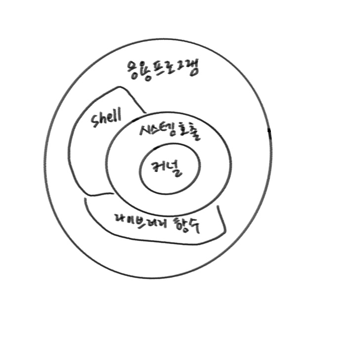
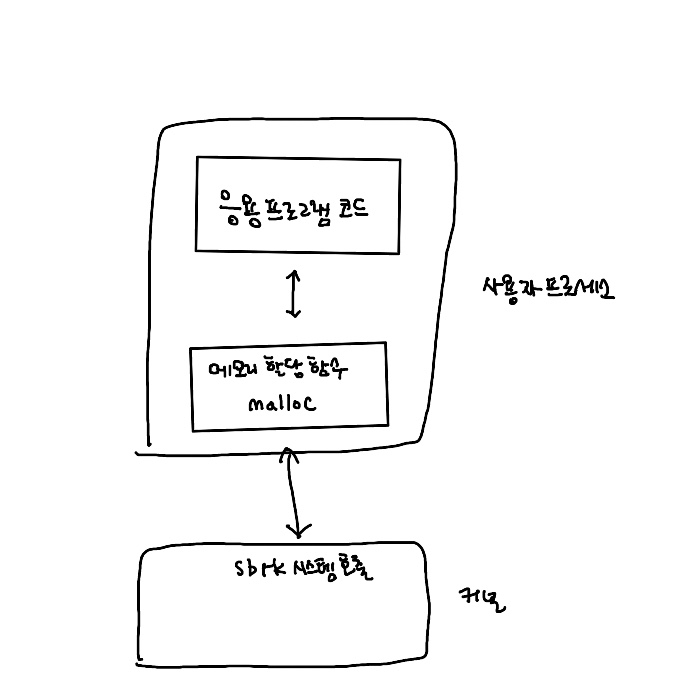
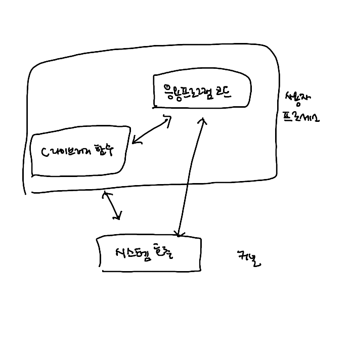

## 제 1장 UNIX 시스템 개요

> 1.1 소개

모든 운영체제는 운영체제 안에서 실행되는 프로그램들에게 여러가지 서비스 제공함.

- 새 프로그램 실행
- 파일 열기, 파일 읽기
- 메모리 영역 할당
- 현재 시간 얻기 등등..

> 1.2 UNIX 기반 구조

 

> 1.3 로그인

- 패스워드 파일은 보통 `/etc/passwd`임.
- 패스워드 파일 => 7개의 필드로 구성됨. (로그인 이름, 암호화된 패스워드, 사용자 ID 정수, 그룹 ID 정수, 주석 필드, 홈 디렉터리, 셸)
  `sar:x:205:105:Stephen Rago:/home/sar:/bin/ksh`

- 셸
  | 셸 이름 | 출시연도 | 주요 특징 |
  |---------|----------|-----------|
  | Thompson Shell | 1971 | 최초의 유닉스 셸, 기본적인 명령어 실행과 파이프라인 지원 |
  | Bourne Shell | 1977 | 스크립팅 기능 강화, 변수와 함수 지원, 현대 셸의 기반 |
  | C Shell | 1978 | C 언어와 유사한 문법, 명령어 히스토리, 작업 제어 기능 |
  | Korn Shell | 1983 | Bourne Shell 호환성 유지, 고급 스크립팅 기능 추가 |
  | Tcsh | 1983 | C Shell의 개선판, 명령어 자동완성 기능 강화 |
  | Bash | 1989 | GNU 프로젝트의 일환, Bourne Shell 호환, 다양한 확장 기능 |
  | Zsh | 1990 | 강력한 자동완성, 테마 지원, 플러그인 시스템 |
  | POSIX Shell | 1992 | 셸 표준화, 호환성 보장을 위한 스펙 정의 |

> 1.4 파일과 디렉터리

- 파일 시스템

  - 파일 시스템은 루트라고 부르는 디렉터리에서 시작함.

- 파일 이름

  - 한 디렉터리 안의 이름을 파일이름이라고 부름. 파일 이름에 사용할 수 없는 문자는 2개 (/,null)
  - 새 디렉터리 만들면, 자동으로 생성되는 파일이름 2개 => .(도트:현재) & ..(도트-도트:부모)

- 경로 이름
  - 하나 이상의 파일이름들이 슬래시로 연결된 형태 (/로 시작하는 절대경로, 상대경로가 존재함)
  - 한 디렉터리의 모든 파일을 나열하는 프로그램

```c
#include <dirent.h>  // 디렉터리 처리를 위한 헤더
#include <stdio.h>   // 표준 입출력 헤더

int main(int argc, char *argv[]) {
   DIR *dp;                                    // 디렉터리 포인터
   struct dirent *d;                           // 디렉터리 엔트리 구조체
   char *path = argc > 1 ? argv[1] : ".";      // 인자가 없으면 현재 디렉터리

   if((dp = opendir(path)) == NULL) {          // 디렉터리 열기 실패 시
       perror(path);
       return 1;
   }

   while((d = readdir(dp)) != NULL) {          // 디렉터리 엔트리 순회
       printf("%s\n", d->d_name);              // 파일 이름 출력
   }

   closedir(dp);                               // 디렉터리 닫기
   return 0;
}

```

- 작업 디렉터리

  - 현재 작업 디렉터리(CWD)라고도 불림.
  - chdir 함수를 이용하여 자신의 작업 디렉터리를 변경 할 수 있음.

- 홈 디렉터리
  - 사용자가 로그인 하면 작업 디렉터리는 사용자의 홈 디렉터리로 설정됨.

> 1.5 입력과 출력

- 파일 서술자
  - 커널이 한 프로세스가 접근는 파일들을 식별하기 위해 사용하는 것.
- 표준입력, 표준출력, 표준오류
  - open, read, write, lseek, close 함수는 버퍼링 없는 입출력 기능 제공함.
- 표준 입출력
  - 버퍼링 없는 입출력 함수들에 대한 버퍼링 있는 인터페이스를 제공함.
  - printf가 가장 흔한 예임.

> 1.6 프로그램과 프로세스

- 프로그램
  - 디스크 디렉터리에 있는 실행 파일임.
  - 프로그램 실행은 일곱가지 exec 함수 중 하나의 호출에 의해 시작됨.
- 프로세스와 프로세스 ID
  - 현재 실행되고 있는 프로그램의 한 인스턴스를 프로세스라고 부름.
  - 실행 중인 프로그램을 태스크라고 부르는 운영체제도 있음.
  - 프로세스 ID는 식별자이고, 항상 음이 아닌 정수임.
- 프로세스 제어
  - fork, exec, waitpid는 프로세스 제어를 위한 주요 함수임.
- 스레드와 스레드 ID

  - 하나의 프로세스에는 제어 줄기 하나만 존재함. 즉 일단의 기계어 명령어들이 한번에 하나씩 실행됨.
  - 제어의 줄기가 여러 개이면 다중 프로세서 시스템에서 가능한 병령성을 활용할 수 있게됨 => 스레드라고 부름.
  - 각 스레드는 자신만의 스택에서 실행됨.
  - 모든 스레드는 자신과 같은 프로세스에 속한 다른 스레드 스택에 접근이 가능. (스레드들이 메모리에 접근할 수 있기에 일관성이 깨지지 않게 하기 위해선 공유 자료에 대한 여러 스레드들의 접근을 동기화할 필요가 있음.)
  - 스레드도 프로세스처럼 ID로 식별하지만, 스레드 ID들은 한 프로세스 안에서만 유효함 => 다른 프로세스에서는 아무 의미가 없음.

> 1.7 오류 처리

- UNIX 시스템 함수들은 오류가 발생하면 음의 값을 돌려줌. 또한 원인을 말해주는 값이 errno라는 정수 개체에 설정되는 경우가 많음.
- errno와 관련해서 기억해야 할 규칙 2가지
  1. 어떤 루틴에서 오류가 없었다고 해서 errno의 값이 비워지지 않음 => errno의 값은 함수의 반환값을 통해서 오류가 발생했음을 확인한 경우에만 점검해야됨.
  2. errno의 값을 0으로 설정하는 함수는 없음. <errno.h>에 정의된 상수들 중 값이 0인 것은 없다.
- 오류 복구
  - <errno.h>에 정의된 오류들 크게 2가지 범주로 나눌 수 있음.
    1. 치명적 오류(fatal error) - 복구 동작이 전혀 없음. 에러뿜고 종료
    2. 치명적이지 않은 오류(nonfatal error) - 임시적, 시스템 활동이 적을 때에는 발생X
    - EAGAIN, ENFILE, ENOBUFS, ENOLCK, ENOSPC, EWOULDBLOCK, (ENOMEM)

> 1.8 사용자 식별

- 사용자 ID

  - ID가 0인 사용자를 루트 혹은 슈퍼사용자라고 부름.
  - 운영체제 함수들 중에는 슈퍼사용자만 사용할 수 있는 것들이 있음. => 모든 것을 마음대로 제어 가능

- 그룹 ID
  - 사용자들을 프로젝트나 부서 별로 조직화하는 용도로 쓰임.
- 추가 그룹 ID
  - 4.2BSD에서 시작됨. 한 사용자가 최대 16개 추가 그룹에 속할 수 있음.
  - POSIX는 한 시스템이 프로세스당 8개의 추가 그룹을 지원해야 한다고 요구함. 그러나 대부분은 16개.

> 1.9 신호

- 어떤 특정한 조건이 발생했음을 프로세스에게 알려주는 기법
  - ex) 0으로 나누기 예외 발생 => 프로세스에게 SIGFPE 라는 이름의 신호가 전송 => 1. 신호 무시, 2. 기본 동작 발생, 3. 신호 처리할 함수 호출

> 1.10 시간 값

- 달력 시간(초의 개수) 자료형식 time_t (UTC 1970-01-01 00:00:00)
- 프로세스 시간. (CPU시간) clock tick 초당 50, 60, 100틱이 쓰임.
- 한 프로세스에서는 클록 시간(벽시계 시간), 사용자CPU시간(소비된 시간), 시스템 CPU시간(프로세스의 요청에 의해 커널이 소비한 CPU시간) 값을 관리함.

> 1.11 시스템 호출과 라이브러리 함수

- 프로그램이 커널에게 서비스를 요청할 수 있는 서비스 지점들을 제공함.=> 시스템 호출
- Linux 3.2.0 시스템 호출 320개, FreeBSD 8.0은 450개가 넘음.
  
  
- 시스템 호출과 라이브러리 함수 모두 함수라고 지칭함.
